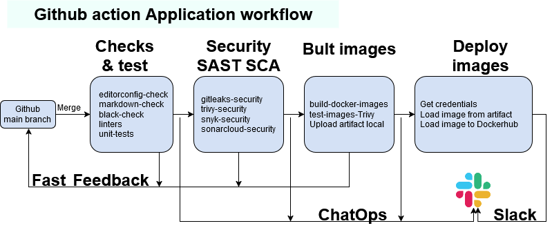

## GitHub Actions CICD pipeline
Create a  pipeline that runs on PR to a trunk branch (i.e. not `main`) and performs the following checks on my app.\
I use *parallel runners* and the necessary *dependencies* in jobs.\
Workflow is created in **.github/workflow/app-ci-pipeline.yaml**

***
> - Check `.editorconfig` - job in workflow **editorconfig**
> - Check makrdown files  - job in workflow **markdown-link-check**
> - Code style  - job in workflow **lint-black**
---
> - Code Lint and Unit test -  job in workflow  **lint-unit-tests**
> - Check for hardcoded secrets (`gitleaks`) - job in workflow  **gitleaks-security**
> - Trivy check repo(fs) - job in workflow  **trivy-security**
> - SAST - SonarCloud; Review code smells and security issues - job in workflow  **sonarcloud-security**
> - SCA - Snyk; review security issues - **integrated** in my github account
---
> - Build a Docker images with *matrix strategy*. Use Git commit SHA as an Image tag.
> - Check image can be runing.
> - Scan the built image with `Trivy`.
> - Create *artefacts* and upload it.
> - Job in workflow  **build-test-images** .
---
> - Get credential from Git Action Secrets(Hashi Vault)
> - Load images from *artifacts* with *matrix strategy*
> - Docker image versioning with Git commit SHA as an Image tag.
> - Push the built image to my *Docker hub* account.
> - Job in workflow  **deploy**
