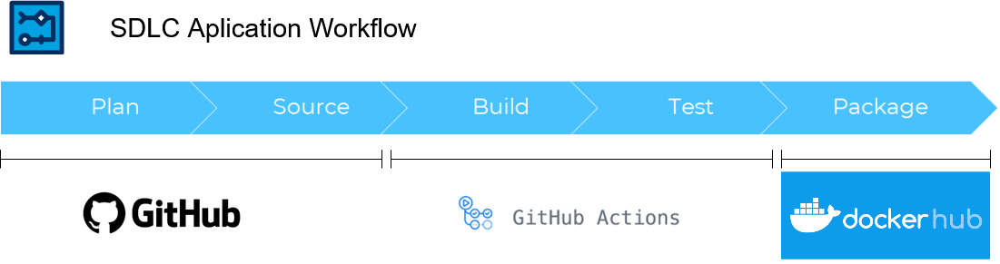

## Workflows structure

## Applycation workflow

> - *ci-app-pipeline.yml* [More here in .github/workflows/CI_APP_README](CI_APP_README.md)
> - Different type of checks: code quality and lint, hardcoded credentials, securety and others
> - Build Docker images
> - Upload to registry

## Terraform workflow
### All structure are in AWS
### Common structure: Bucket and ...
> - tf-common.yml  - Checks, creation plan and save to backend bucket
> - tf-common-apply.yml  - Manual aprrove copy plan from backend bucket and apply

### EKS structure: Create PVC, EKS cluster ...
> - tf-eks.yml  - Checks, creation plan and save to backend bucket
> - tf-eks-apply.yml  - Manual aprrove copy plan from backend bucket and apply

### EKS add ons structure: Create  with helm ARGOCD, Observability Prometeus and Grafana ...
> - tf-eks-add-ons.yml  - Checks, creation plan and save to backend bucket
> - tf-eks-add-ons-apply.yml  - Manual aprrove copy plan from backend bucket and apply

### Hashi vault structure: Create from packer AMI EC2 instance with instaled Vault in separate VPC ...
> - cicd-packer-vault.yml  - Checks, creation plan and save to backend bucket
> - tf-vault-apply.yml  - Manual aprrove copy plan from backend bucket and apply
> - tf-vault-destroy.yml  - Manual aprrove copy plan from backend bucket and destroy vault infrastructure
