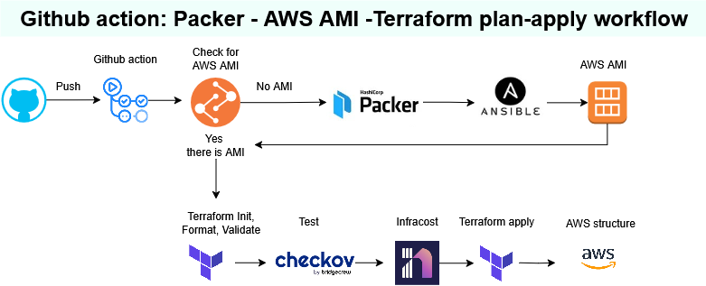

## Workflows structure

## Applycation workflow

> - *ci-app-pipeline.yml* [More here in .github/workflows/CI_APP_README](CICD_APP_README.md)
> - Different type of checks: code quality and lint, hardcoded credentials, securety and others
> - Build Docker images
> - Upload to registry

## Terraform workflow
### All structure are in AWS

### Common structure: Bucket and  VPC ...
> - tf-common.yml  - Checks, creates a plan and applying with Terraform

### EKS structure: Create PVC, EKS cluster ...
> - tf-eks.yml  - Checks, creates a plan and applying with Terraform

### EKS add ons structure: Create  with helm ARGOCD, Observability Prometeus and Grafana ...
> - tf-eks-add-ons.yml  - Checks, creates a plan and applying with Terraform

### Hashi vault structure: Create from packer AMI EC2 instance with instaled Vault ...
- cicd-packer-vault.yml
  - Check for existing AMI if not found created with Hashi Paker
  - Checks, creates a plan and applying with Terraform
    - save tokens in AWS
    - set Dynamodb for storage
    - use AWS KMS for unsealing Vault
    - use Let's Encript starting Vault with secure communication
    - add EC2 instance IP address in AWS Route53 record

.

- [More details for Packer in packer/README](../../packer/README.md)
- [More details for Terraform create EC2 in terraform/aws_vault/README](../../terraform/aws_vault/README.md)

### EKS external secrets structure: Create secrets in EKS from Hashi vault ...
> - tf-eks-external-secrets.yml
    - Checks, creates a plan and applying with Terraform
