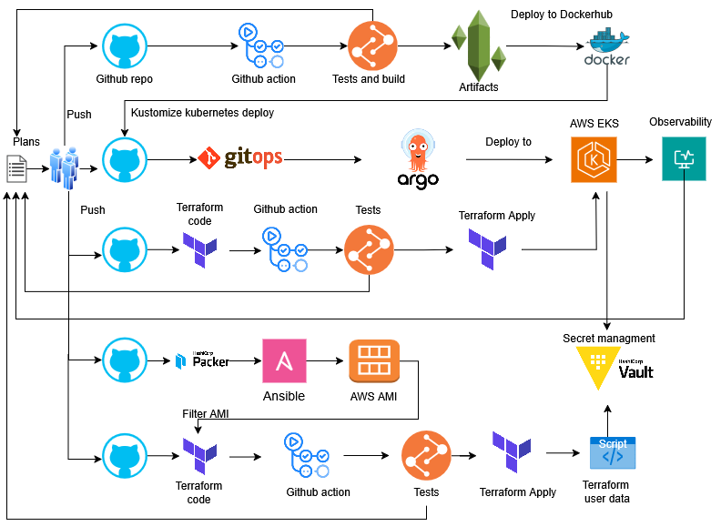

# Fun Facts Microservices Application
A final project used for the following courses **Upskill 34 DevOps**  at **Telerik**:
## Project diagram

## Project description:
> - All code is in Source control on GitHub.
> - Three-component python application in Docker containers.
> - CICD part builds workflows in GitHub Action.
> - Building infrastructure (IaC) in AWS using Terraform.
> - Security management is implemented with hash Vault created on Immutable infrastructures in AWS AMI.
> - Deploying the application in a Kubernetes cluster with GitOps(Argocd) pattern.
> - Simple observability with Prometheus and Grafana.

## Branching strategy
For this repo I'm using Trunk Based Development (TBD) flow strategy, because:
> - Branch are small and self sufficiental;
> - Keep close to the `main` branch;
> - Reduce merge conflicts
> - Fast feedback loops for the CI part;
> - Quick release.

## Setup my own dev environment
### Create a simple tests for safeguards like: pre-commit hooks (linters, fixers),  AI coding assistant(copilot)  and etc.
***
> - check-yaml, end-of-file-fixer, check-added-large-files, check-merge-conflict, gitleaks, black and more.

## Application Components
Simple python app with 3 components.
> - backend generator of data
> - storage for save data in database
> - frontend web interface for dispaly data
> - [More here in app/README](app/README.md)

## Continuous Integration (CI) and continuous delivery/deployment (CD)  Components
***
The CICD workflow is defined in GitHub Actions.\
It is triggered on PR to a trunk branch in the repository,
ensuring that the codebase is continuously integrated and fully tested.

> - [More here in .github/workflows/README](.github/workflows/README.md) with details.

## Building infrastructure (IaC)
### Infrastructure in AWS
> - [More here in main terraform/README](terraform/README.md) with details.
### Immutable infrastructures with Packer
> - [More here in packer/README](packer/README.md) with details.

## Deep dive in Hashi Vault
### I will present theory and possibilities when using Hashi Vault. Demonstration of several techniques related to AWS and databases.
> - [More here in hashi_vault_doc/README](hashi_vault_doc/README.md) with details.

## Future Improvements:
> - Add Route53 DNS Records and SSL/TLS for Hashi Vault and Kubernetes Load Balancer
> - Implement ChatOps with Slack
> - Improve Hashi Vault with Auto Unseal and DynamoDB Backend
> - Reducing the number of VPCs, merging EKS with the Vault instance in one VPC.

## License:
### Terms of Use

[MIT License]
Please refer to the 'LICENSE' file in this repo for the specific terms and conditions governing the use of this project.

## Contributors and Collaborators
### Contributors
> - Metodi Lichkov - github: https://github.com/metodil

### Collaborators
> - Iliyan Vutoff - github: https://github.com/vutoff
> - Daniel Rankov - github: https://github.com/severel
