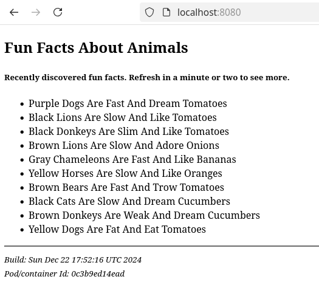

It is a set of three Docker containers, each with a dedicated role. Together they form a simple web application.
***
The general setup looks like:


> - Properly export: DB_HOST, DB_USER, DB_PASS, DB_ROOT_PASSWORD, DB_NAME
> - Sample : DB_HOST='con-storage', DB_USER='postgres', DB_PASS='MySecPass', DB_ROOT_PASSWORD='MySecPass', DB_NAME='animal_facts'

Using
```bash
cd app
docker compose up -d
```
***
The result would be something like this:


