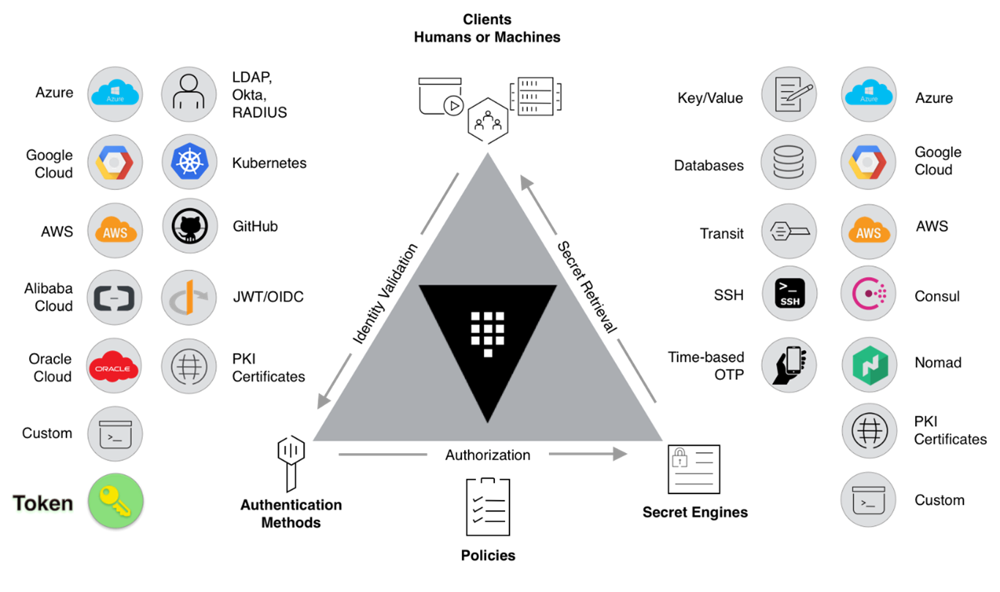

 Hashi Vault

## Vault Community Edition and Vault Enterprise.

> -   Namespaces
> -   Secrets
> -   Secrets Engines
> -   Paths
> -   Authentication Methods
> -   Policies
> -   Tokens
> -   Wrapped Tokens - one-time use Token
> -   Entities
> -   Groups
> -   Roles
***

-   Namespaces

Only available with the Enterprise license of Vault. A Namespace allows
different teams, customers or tenants to manage their own configuration
of Vault, isolated and independently of other.

-   Secrets

Key-value pairs, Passwords, Database access, TLS keys and certificates,
API Keys, Encryption keys, SSH keys, Tokens and more...

-   Tokens

Tokens are fundamental to managing the access to resources such as
Secrets and Auth Methods within Vault. Whenever a client wants to do
anything with a resources, it must handover a valid Token. From the
Token, Vault determines the Policies. All Tokens have a Time To Live
(TTL)

• Entities

Entities represent the client within Vault. A specific Entity can be
authenticated through multiple Auth Methods it is diffrent Entity
Aliases

-   Groups

A Group can hold any number of Entities and an Entity can belong to any
number of Groups.

-   Policies

Policies provide a declarative way to grant or forbid access to
operations in Vault.

-   Vault roles

A role is collection of parameters that you group together to simplify
plugin configuration.

-   Authentication methods

With CLI, UI, HTTP API and terraform provider

-   Secrets engines

Can be created, read, updated and deleted ,encrypted, be expired after a
Time To Live (TTL), be expired after a maximum life time, be
automatically created, be revoked, be versioned

*Static* - The kv secrets engine is a generic key-value store used to
store arbitrary secrets within the configured physical storage for
Vault. This secrets engine can run in one of two modes; store a single
value for a key **KV version 1**, or store a number of versions for each
key and maintain the record of them **KV version 2**.

*Dynamic secrets* do not exist until read, so the risk of being stolen
is greatly reduced. Because Vault has built-in revocation mechanisms,
Vault revokes dynamic secrets after use thereby minimizing the amount of
time the secret existed



## Demonstration

## Static secrets
Using
```bash
# Initializing KV version 2 vault...

vault secrets enable -version=2 -path=secrets kv

# Adding entries secrets
vault kv put secrets/dev username=user
vault kv put secrets/dev password=sec_password
```
## Dynamic AWS IAM users
Using
```bash
vault secrets enable aws

vault write aws/config/root access_key=<access_key>
secret_key=<secret_key> region=<region>

vault write aws/roles/u34-acc-s3-role \
credential_type=iam_user \
policy_document=<<EOF
{
  "Version": "2012-10-17",
  "Statement": [
    {
      "Effect": "Allow",
      "Action": "s3:*",
      "Resource": "*"
    }
  ]
}
EOF
    default_lease_ttl:"1h" \
    max_lease_ttl:"24h"

vault read aws/creds/u34-acc-s3-role

# API call
curl \
    --header "X-Vault-Token: <Vault-Token>" \
    --request GET \
    http://127.0.0.1:8200/v1/aws/creds/u34-acc-s3-role
```

## Dynamic database secrets
```bash
export AWS_POSTGRES_DB_USER=postgres
export AWS_POSTGRES_DB_PASS='u34_very_secret_password'
export AWS_POSTGRES_DB_HOST=<DB_HOST>

vault secrets enable database

vault write database/config/u34-postgresql-database \
    plugin_name=postgresql-database-plugin \
    allowed_roles=u34-db-dcr-role" \
    connection_url="postgresql://{{username}}:{{password}}@${AWS_POSTGRES_DB_HOST}/" \
     username=${AWS_POSTGRES_DB_USER} \
     password=${AWS_POSTGRES_DB_PASS}


vault write database/roles/u34-db-dcr-role \
  db_name=u34-postgresql-database \
  creation_statements="CREATE ROLE \"{{name}}\" WITH LOGIN PASSWORD '{{password}}' VALID UNTIL '{{expiration}}'; \
                      GRANT SELECT ON ALL TABLES IN SCHEMA public TO \"{{name}}\";" \
  default_ttl="1h" \
  max_ttl="24h"

vault read database/creds/u34-db-dcr-role

curl \
    --header "X-Vault-Token: <Vault-Token>" \
    --request GET \
    http://127.0.0.1:8200/v1/database/creds/u34-db-dcr-role
```
