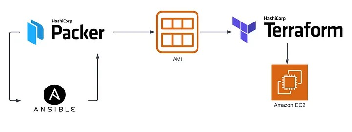

## Create AWS AMI with Hashi Packer

### Using Packer with Ansible provider for instaling and setup Hashi Vault

> - *u34-aws-vault.pkr.hcl* - *Packer file* for creating AMI
> - *u34-vault.yml* - *Ansible playbook* for instaling and setup
> - *init.service.j2* - Hashi Vault init service file
> - *vault.hcl.j2* - Hashi Vault setup file

## Packer Configuration

    source file: packer/u34-aws-vault.pkr.hcl

The Packer template utilizes the amazon-ebs builder with the following configuration:

-  AMI Name: "u34-vault-ami"
-  Instance Type: "t2.micro"
-  Region: "eu-central-1"
-  Source AMI Filter:
    - Filters for the latest Ubuntu 22.04 AMD64 server image.
    - Filters for EBS root device type and HVM virtualization type.
    - Owner set to Canonical (owner ID: "099720109477").
-  SSH Username: "ubuntu"
-  Provisioner: ansible

How to Use

    Install Packer on your local machine.
    Clone this repository and navigate to the ./packer folder
    Review and customize the Packer template (packer.pkr.hcl) if needed.
    Run the Packer build command: packer build ubuntu-ami.pkr.hcl.

The resulting AMI will be available in your AWS account with the specified name ("u34-vault-ami") and configuration.

## Configuration managment with Ansible

    source file     : packer/u34-vault.yml - Ansible playbook
    service file    : packer/init.service.j2 - Hashi Vault init service file
    setup file      : packer/vault.hcl.j2 - Hashi Vault setup file

Ansible Playbook Desired State Configuration: Install and setup Hashi Vault

The following Ansible playbook automates the installation of Hashi Vault on an EC2 target instance.

Playbook Tasks:
> - name: Creating vault user group
> - name: Creating vault user
> - name: Install prerequisites
> - name: Download binary
> - name: Unzip vault archive
> - name: Create storage
> - name: Check if install was successful
> - name: Copy systemd init file
> - name: Copy config file
> - name: Vault service start
> - name: Pause for 30 seconds
> - name: Vault init
> - name: Vault init data
> - name: Save vault data
> - name: Vault unseal
> - name: Vault status
> - name: Vault status report

This playbook ensures the installation and desired configuration of Hashi Vault.
